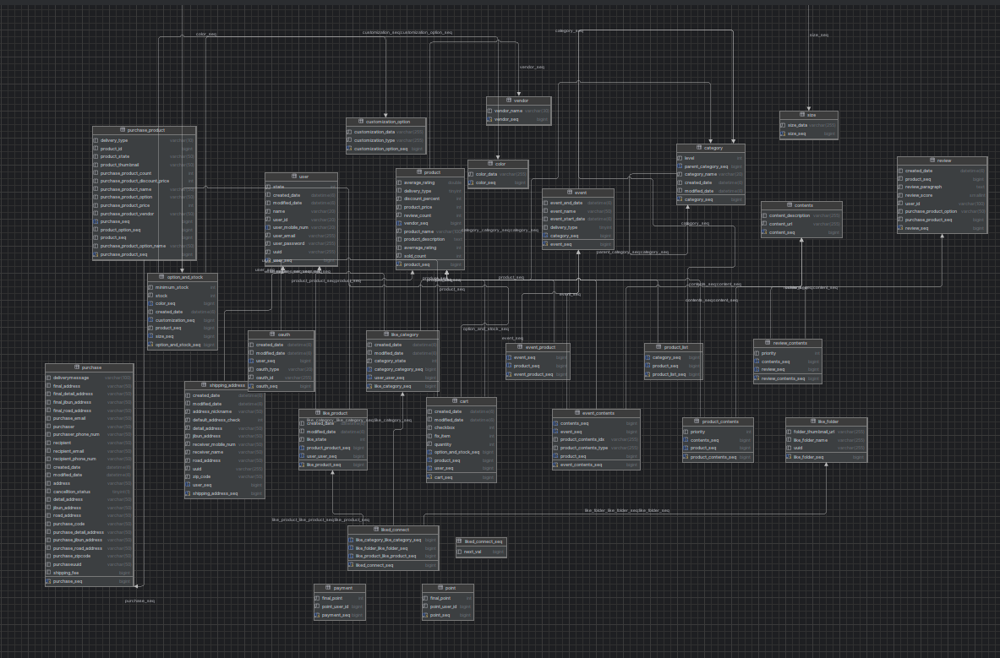

# 🛒 SSG.COM 클론코딩

 
 

- 배포 URL : https://ssgssak.shop
- Test ID : spharos1
- Test PW : spharos2024

 

# 목차
1. [프로젝트 개요](#1-프로젝트-개요)
2. [팀원 구성](#2-팀원-구성)
3. [시스템 아키텍처](#3-시스템-아키텍처)
4. [기술 스택](#4-기술-스택)
5. [파일구조](#5-파일구조)
6. [ERD](#6-ERD)
7. [역할 분담](#7-역할-분담)
8. [구현 기능](#8-구현-기능)
9. [트러블 슈팅](#9-트러블-슈팅)
10. [개선 목표](#10-개선-목표)
11. [프로젝트 후기](#11-프로젝트-후기)

 

# 1. 프로젝트 개요
**진행 기간** :  2024.02.21 ~ 2024.04.16

**목표**
- 단순히 코드를 따라치는 클론코딩이 아닌 쓱닷컴 서비스 분석 및 DB 설계 과정을 거쳐 문서 작성 및 개발 프로세스를 익힘
-  프로젝트에 다양한 기술을 적용하여 새로운 기술들을 학습
- 팀 프로젝트를 통해 협업 툴 사용 및 협업 방식을 습득

 

# 2. 팀원 구성
| **Name**     | 박태훈                                                                  | 박진영                                                                  | 박찬웅                                                                  | 김예진                                                                  | 서여진                                                                                                                                  |
|:------------:|:--------------------------------------------------------------------:|:--------------------------------------------------------------------:|:--------------------------------------------------------------------:|:--------------------------------------------------------------------:|:--------------------------------------------------------------------:|
| **Profile**  || | |  |  |  
| **Position** | Backend   (팀장)      | Backend              | Backend          | Frontend                   | Frontend            | 

 

# 3. 시스템 아키텍처

 

# 4. 기술 스택

## 💻 IDE

## 📱 Frontend
    

## 💾 Backend

     

## 🔃 DevOPS

 

 

# 5. 파일구조

 

# 6. ERD

 

# 7. 역할 분담
### 🌗Frontend
 - #### 김예진
 	- 홈, 공통컴포넌트(헤더, 푸터, 네비게이션 등), 검색 모달
 	- 상품 리스트, 이벤트 및 베스트 상품 페이지 및 기능
 	- 상품 키워드 검색, 카테고리 별 조회 페이지 및 기능
 	- 회원 상품 좋아요 페이지 및 기능
 	- 회원/비회원 상품 주문 페이지 및 기능

 - #### 서여진
 	- 로그인, 회원가입, 마이페이지
 	- 배송지 관리 페이지 및 기능
 	- 상품 상세 페이지 및 기능
 	- 회원 장바구니 페이지 및 기능
 	- 상품 리뷰 조회 및 회원 리뷰 기능

### 🌓Backend
 - #### 박태훈
 	- 자동 배포 환경 구축
 	- 카테고리 도메인
 	- 주문 도메인

 - #### 박진영
 	- 상품 도메인(검색, 상세조회, 필터링)
 	- 리뷰 도메인
 	- 회원 장바구니 도메인

 - #### 박찬웅
 	- 스프링시큐리티 및 JWT 적용
 	- oAuth 및 이메일 인증(Redis 활용)
 	- 회원 도메인(로그인, 회원가입 등)
 	- 회원 좋아요 도메인
 

# 8. 구현 기능

 

# 9. 트러블 슈팅

 

# 10. 개선 목표
- Recoil을 통한 상태관리 및 성능 개선
	- Recoil을 도입하기 전 props depth가 깊어지면서 상태관리의 어려움이 있었고, 전달받은 상위 컴포넌트의 state 변경 시 하위 모든 컴포넌트의 리렌더링을 유발하는 문제가 있음.
	- 장바구니 기능 구현 중 전역 상태관리를 위해 뒤늦게 Recoil을 도입하면서 `상태관리의 중요성`을 느꼈음.
	- 추후 지나친 Prop Drilling이 있는 컴포넌트에 Recoil을 적용하여 상태(atom)를 `구독하는 컴포넌트만 업데이트`함으로써 `불필요한 렌더링을 방지`하여  성능을 개선할 예정.
   
 

# 11. 프로젝트 후기

 

